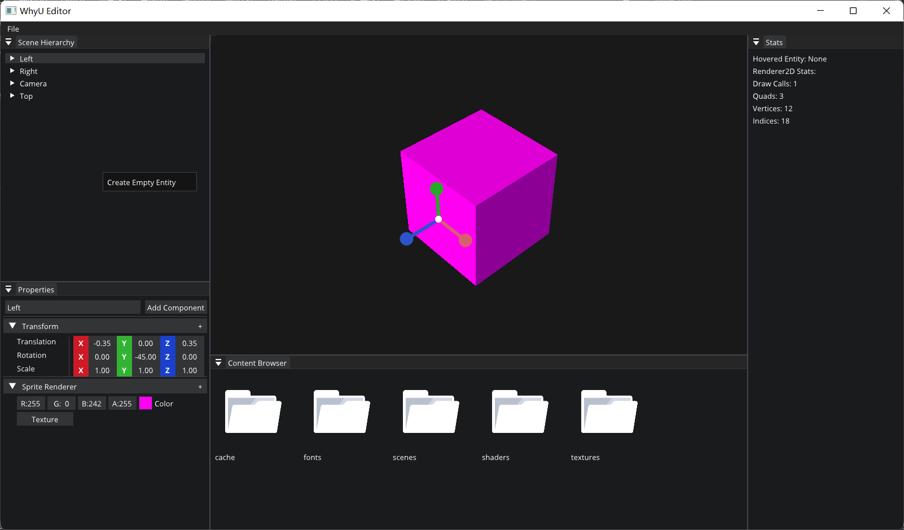

# HzEngine
A C++ Mini Game Engine!

This project is based on the Hazel engine of the Cherno. Thank you very much for Cherno's open source and videos.

This project includes spdlog log system, glfw event system, Layer layer design, Imgui input interface and visual debugging，OpenGLRendering

1. LogSystem：Create the Log class, and then have s_ CoreLogger and s_ ClientLogger, which processes engine logs and client logs respectively.

2. EventSystem：Event&EventDispatcher: Mouse Event、Window Event、ApplicationEvent and KeyEvent.

3. LayerStack: A vector is used to simulate a stack as a container, and vector [0] is used as the top of the stack. The layer at the top of the stack is the closest layer to us on the screen. This layer receives the event first, and is finally rendered.

4. InputSystem: The input instance can use the singleton mode. The interface exposed by the singleton is the static function, and the specific implementation method is the virtual function of the singleton.

5. ImguiDocking: Docking of Imgui to realize editor dragging.

6. OpenGLRendering: VBO、VAO、EBO、shader Abstraction：

   Vertex Buffer Layouts、Vertex Arrays、shaer、EBO part is easy

7. Camera： P * V：OrthographicCamera&EditorCamera

8. Timestep system：By multiplying the motion in each frame by the time elapsed in that frame, you can counteract the problem of data inconsistencies caused by frame rate.

9. Profiling: Instumentor.h

10. Batching Rendering: Modify the DrawQuad function to dynamically populate Vertex Buffer with vertex attribute data to be drawn when drawing.

    VertexBuffer: GL_STATIC_DRAW to GL_DYNAMIC_DRAW

11. Editor

12. FrameBuffer : Resize:change the camera frustum

13. ECS: entt(Add、Has、Get)

14. UI

15. File system: Saving and Loading Scenes: YAML 、Open/Save File Dialogs：：https://docs.microsoft.com/en-us/office/[vba](https://so.csdn.net/so/search?q=vba&spm=1001.2101.3001.7020)/api/excel.application.getopenfilename

16. Gizmos：ImGuizmo::Manipulate(glm::value_ptr(cameraView), glm::value_ptr(cameraProjection), ImGuizmo::OPERATION::TRANSLATE, ImGuizmo::LOCAL, glm::value_ptr(transform));

17. Multiple Render Targets and Framebuffer Refactor：Click on the corresponding GameObject in the Viewport

18. SPIR-V & shaderc:

19. UniformBuffer：A piece of memory located on the GPU can be shared by all Shader

