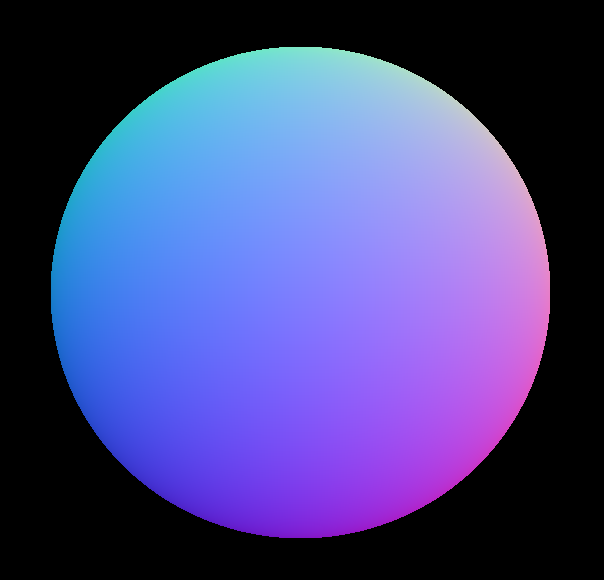
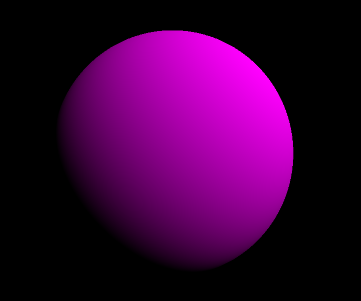
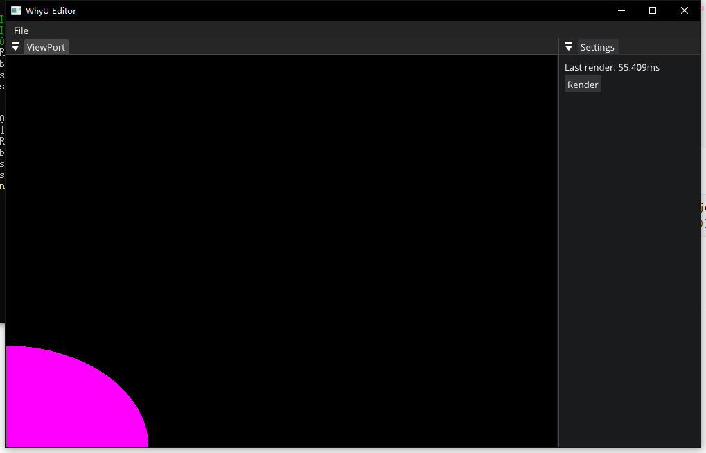
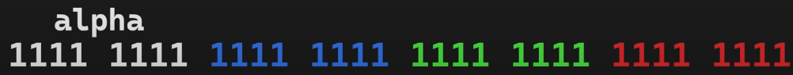

## RayTracing

### 1. Image Render

##### Q1. GL_Texture format error

单步调试，发现问题出在Image::GetImage()， When GetImage Don't UpdateData(setData)，这样会导致databuffer尺寸不匹配

##### Q2. 图片上下翻转

```cpp
ImGui::Image((void*)image, m_RenderViewPortSize, ImVec2(0, 1), ImVec2(1, 0));
```

ImGUI默认从（0，0）到（1， 1），从左上到右下（左手）.

##### Q3.材质提交和设置材质数据

glTextureStorage2D，glTexImage2D：使用下面可以提交DataFormat

```cpp
//glTextureStorage2D(m_RendererID, 1, m_InternalFormat, m_Width, m_Height);
glTexImage2D(GL_TEXTURE_2D, 0, m_InternalFormat, m_Width, m_Height, 0,
m_DataFormat, GL_UNSIGNED_BYTE, nullptr);
```

glTextureSubImage2D：提交Data（Void* 内存）

```cpp
glTextureSubImage2D(m_RendererID, 0, 0, 0, m_Width, m_Height, m_DataFormat, GL_UNSIGNED_BYTE, data);
```

### 2. Render Sphere：

光线从相机位置出发，穿过UV， 与圆求交（解二元一次方程）

##### Base:



##### Shadow: 



##### Q1.  球渲染不全

将UV坐标转换，in RenderImage‘s Forloop

```cpp
vec2Coord = vec2Coord * 2.f - 1.f; //(0~1)->(-1,1)
```



##### Q2 只是为了求Fa不要对rayDirection归一化

额外性能付出，需要求模

```cpp
// rayDirection = normalize(rayDirection);
// float fA = 1.0f;
float fA = glm::dot(rayDirection, rayDirection);
```

##### Q3 0xff00000 -> vec4(0, 0, 0, 1)



a << 24 | b << 16 | g << 8 | r

### 3.Camera