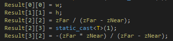
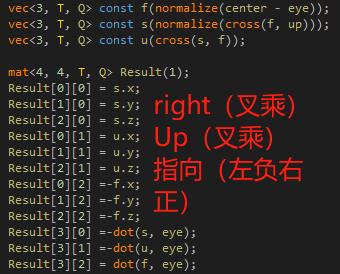
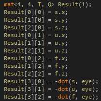

## RayTracing

### 1. Image Render

##### Q1. GL_Texture format error

单步调试，发现问题出在Image::GetImage()， When GetImage Don't UpdateData(setData)，这样会导致databuffer尺寸不匹配

##### Q2. 图片上下翻转

```cpp
ImGui::Image((void*)image, m_RenderViewPortSize, ImVec2(0, 1), ImVec2(1, 0));
```

ImGUI默认从（0，0）到（1， 1），从左上到右下（左手）.

##### Q3.材质提交和设置材质数据

glTextureStorage2D，glTexImage2D：使用下面可以提交DataFormat

```cpp
//glTextureStorage2D(m_RendererID, 1, m_InternalFormat, m_Width, m_Height);
glTexImage2D(GL_TEXTURE_2D, 0, m_InternalFormat, m_Width, m_Height, 0,
m_DataFormat, GL_UNSIGNED_BYTE, nullptr);
```

glTextureSubImage2D：提交Data（Void* 内存）

```cpp
glTextureSubImage2D(m_RendererID, 0, 0, 0, m_Width, m_Height, m_DataFormat, GL_UNSIGNED_BYTE, data);
```

### 2. Render Sphere：

光线从相机位置出发，穿过UV， 与圆求交（解二元一次方程）

##### Base:


##### Shadow: 


##### Q1.  球渲染不全

将UV坐标转换，in RenderImage‘s Forloop

```cpp
vec2Coord = vec2Coord * 2.f - 1.f; //(0~1)->(-1,1)
```


##### Q2 性能优化：只是为了求Fa不要对rayDirection归一化

额外性能付出，需要求模

```cpp
// rayDirection = normalize(rayDirection);
// float fA = 1.0f;
float fA = glm::dot(rayDirection, rayDirection);
```

##### Q3 0xff00000 -> vec4(0, 0, 0, 1)


a << 24 | b << 16 | g << 8 | r

### 3.Camera

##### Q1. GL Error


同样问题发生在image ::setdata上，m_RenderViewPortSize（渲染窗口）初始化为0，会给一个0大小的texture data，从而报错，在场景resize之前加上

```cpp
if (m_RenderViewPortSize.x > 0 && m_RenderViewPortSize.y > 0)
```

##### Q2.  性能优化：Raytracing camera

给定一个flag如moved，当Input::IsKeyPressed（）后，flag为true，重新计算V矩阵！

将光线方向缓存，只有动的时候重新计算几个大矩阵！

##### Q3. Projection计算



```cpp
m_Projection = glm::perspectiveFov(glm::radians(m_VerticalFOV), (float)m_ViewportWidth, (float)m_ViewportHeight, m_NearClip, m_FarClip);
```

##### Q4. View矩阵计算

```
m_View = glm::lookAt(m_Position, m_Position + m_ForwardDirection, glm::vec3(0, 1, 0));
```

（RUT摆列）注意，glm::lookat分左手（Opengl）和右手（其他），注意第三列（z旋转）和32符号（z平移）不同（因为z轴指向不同）！！

Opengl：左手



右手：



##### Q5. 相机的旋转使用四元数

通过四元数q，旋转前向方向

```cpp
glm::quat q = glm::normalize(glm::cross(glm::angleAxis(-pitchDelta, rightDirection),
				glm::angleAxis(-yawDelta, glm::vec3(0.f, 1.0f, 0.0f))));
m_ForwardDirection = glm::rotate(q, m_ForwardDirection);
```

##### Q6. 屏幕空间->观察空间->世界空间

重新计算光线方向：由于左手（PVM*World = View）-> (World = M-1 * V-1 * P-1 * View)

```cpp
coord = coord * 2.0f - 1.0f; // -1 -> 1
glm::vec4 target = m_InverseProjection * glm::vec4(coord.x, coord.y, 1, 1);
glm::vec3 rayDirection = glm::vec3(m_InverseView  *glm::vec4(glm::normalize(glm::vec3(target) / target.w), 0)); // World space
```

**glm::vec3(target) / target.w)** : 将 `target` 的前三个分量除以其 w 分量，可以将其还原为一个方向向量

### 4.Multi sphere

##### Q1. Link Error: static变量

```cpp
class RayTracingRenderImage
{
public:
	struct RayTracingData
	{
		Ref<Ray> ray;
		glm::mat4 view;
		glm::mat4 projection;
	};

private:
	static Ref<RayTracingData> m_RayTracingData;
};
```
要解决此问题，请确保**在定义静态成员变量的同时，在某个源文件中也对其进行了定义**。在这种情况下，你需要在某个源文件中添加以下代码：

```cpp
Ref<RayTracingRenderImage::RayTracingData> RayTracingRenderImage::m_RayTracingData = nullptr;
```

##### Q2. glm::value _ptr

```cpp
ImGui::DragFloat3("Position", glm::value_ptr(vecSphere[i]->GetPosition()), 0.1f);
ImGui::DragFloat("Radius", &vecSphere[i]->GetRadius(), 0.1f);
ImGui::ColorEdit3("Albedo", glm::value_ptr(vecSphere[i]->GetMaterial()->GetAlbedo()));
```

作用是返回一个**指向矩阵或向量**数据的指针。

1. 需要注意矩阵和向量的存储顺序，因为它们是列优先存储的。
2. 如果需要访问矩阵或向量的其他列，需要通过指针的算术运算来计算。

##### Q3. Main Steps

动物体positon = 反向动相机位置（即ray.Origin)

1. 解得交点位置，更新最短距离，拿到最近的Sphere
2. 对最近的Sphere，拿到basecolor、法线（击中点）、

```cpp
glm::vec4 RayTracingRenderImage::CastRay(const std::vector<Ref<Sphere>>& spheres)
{
    auto castRay = m_RayTracingData->rayData;

    // 1.Ray hit which Sphere:
    Ref<Sphere> hitSphere = nullptr;
    float hitDistance = std::numeric_limits<float>::max();
    for (auto& sphere : spheres)
    {
        float radius = sphere->GetRadius();
        glm::vec3 origin = castRay->Origin - sphere->GetPosition();

        // Cal part:
        float fA = glm::dot(castRay->Direction, castRay->Direction);
        float fB = 2.f * glm::dot(origin, castRay->Direction);
        float fC = glm::dot(origin, origin) - radius * radius;
        float discriminant = fB * fB - 4.0f * fA * fC;

        if (discriminant < 0.0f) continue;  // if miss, next sphere

        float clostHit = (-fB - glm::sqrt(discriminant)) / (2.f * fA);
        //float h1 = (-fB + glm::sqrt(discriminant)) / (2.f * fA);

        if (clostHit < hitDistance)
        {
            hitDistance = clostHit;
            hitSphere = sphere;
        }
    }

    if (hitSphere == nullptr)
        return glm::vec4(0.0f, 0.0f, 0.0f, 1.0f);

    // 2. Treat the hit Sphere:
    glm::vec3 baseColor = hitSphere->GetMaterial()->GetAlbedo();
    glm::vec3 hitOrigin = castRay->Origin - hitSphere->GetPosition();
    glm::vec3 clostHitPoint = hitOrigin + castRay->Direction * hitDistance;

    // Out part:
    glm::vec3 lightDir = glm::normalize(glm::vec3(-1.f, -1.f, -1.f));
    glm::vec3 normal = glm::normalize(clostHitPoint);

    // Light:
    float diffuse = glm::max(glm::dot(normal, -lightDir), 0.f);
    glm::vec3 color = diffuse * baseColor;

    return glm::vec4(color, 1);
}
```

注意两个问题，可以控制UI bar移动物体位置：

1. 这样写法线仍然是击中点（- hitSphere->GetPosition()）；

2. 注意因为**只是移动相机位置**，**光线没动**，对移动物体的光照发射位置对应光照- hitSphere->GetPosition()